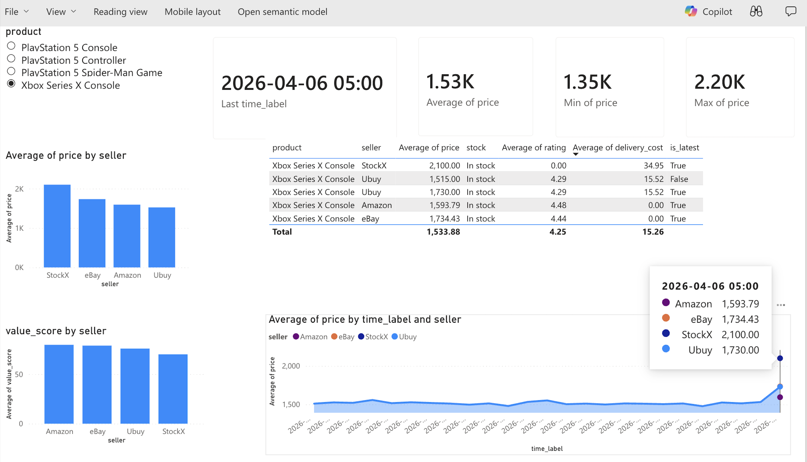

# 🛒 Real-Time E-Commerce Price Intelligence Pipeline



An end-to-end **Real-Time Data Engineering Pipeline** that scrapes live e-commerce pricing data, processes it through a streaming message broker, refines it using a Medallion Architecture, and serves it to a zero-latency Power BI dashboard.

## 🏗️ Architecture Overview

This project implements a modern real-time data stack using **Microsoft Fabric** and **Azure Event Hubs** (Kafka compatible).

1. **Data Source (PricesAPI):** A Python producer script queries the [PricesAPI](https://pricesapi.io/) REST endpoints to scrape live search results for products (e.g., "PlayStation 5") from major retailers like Amazon, eBay, and The Good Guys.
2. **Streaming Broker (Azure Event Hubs):** The raw JSON payloads are formatted into Kafka messages and pushed to an Azure Event Hub (`competition-prices` topic) in real-time.
3. **CI/CD Automation (GitHub Actions):** A GitHub Actions cron job runs the Python producer every hour to create a continuous, automated stream of market data.
4. **Ingestion (Fabric Eventstream):** Microsoft Fabric's Eventstream connects to the Azure Event Hub, acting as the bridge that continuously routes the streaming JSON into the analytics database.
5. **Storage & Analytics (KQL Eventhouse):** The data lands in a highly-optimized Kusto Query Language (KQL) database.
6. **Visualization (Power BI):** A Power BI dashboard connects directly to the KQL database using **DirectQuery**, meaning the charts update instantly as new data arrives without needing manual dataset refreshes.

---

## 🏅 The Medallion Architecture (in KQL)

Raw web-scraped data is incredibly noisy. A search for a "PlayStation 5 Console" will return $500 consoles, but also $20 charging cables, $60 games, and $1,200 scalper bundles—all under the same Product ID! 

To solve this, we built a **Medallion Architecture** entirely inside KQL functions (Views):

*   🥉 **Bronze Layer (`raw_prices_stream`):** An append-only table storing the exact, raw JSON blobs as they stream in from Event Hubs.
*   🥈 **Silver Layer (`silver_price_history`):** A KQL function that expands the nested JSON arrays, strongly types the columns (strings, reals, ints), uses Regex to extract delivery costs from messy text, and injects bulletproof Python timestamps.
*   🥇 **Gold Layer (`gold_shopper_best_deals` & `gold_retailer_price_trends`):** Business-level views that normalize product titles into clean buckets (e.g., mapping "PS5 DualSense" and "PlayStation Controller" into one category), filter out statistical outliers (dropping accessories and scalpers based on variance from the max price), and calculate a custom "Value Score" based on seller rating and delivery cost.

---

## 🚀 How to Run Locally

### 1. Prerequisites
*   Python 3.10+
*   A free API key from [PricesAPI](https://pricesapi.io/)
*   An Azure Event Hub namespace (or Confluent Kafka cluster)
*   A Microsoft Fabric workspace with a KQL Database

### 2. Setup
Clone the repo and install dependencies:
```bash
pip install -r requirements.txt
```

Create your local environment file:
```bash
cp .env.example .env
```
Fill in your API keys and Event Hub connection string inside the `.env` file.

### 3. Fetch Data
You can discover products dynamically by setting `SEARCH_QUERY` in your `.env` file (e.g., `SEARCH_QUERY="apple iphone"`). The script will automatically resolve the IDs and fetch the offers.

Run the producer to fetch the latest prices and push them to your Event Hub:
```bash
python src/fetch_and_publish.py
```

*Note: Included is a `src/backfill_24h.py` script that can automatically generate 24 hours of fake historical market fluctuations for testing and dashboard building.*

---

## 📚 Fabric Deep Dive
For a detailed explanation of how KQL differs from Apache Spark Structured Streaming, how to handle append-only time-series data without checkpoints, and why we chose KQL Functions over Fabric Notebooks, read the included **[FABRIC_CONCEPTS.md](FABRIC_CONCEPTS.md)**.
