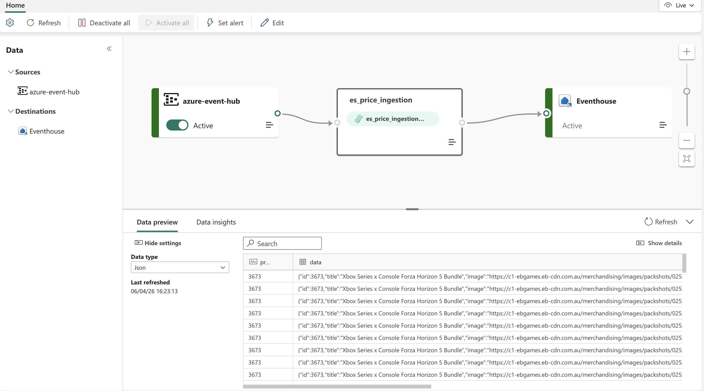

# E-Commerce Price Intelligence Pipeline on Microsoft Fabric




An end-to-end data engineering project that collects live e-commerce offer data, streams it through **Azure Event Hubs**, lands it in **Microsoft Fabric Eventstream + KQL Eventhouse**, models it with a **Bronze / Silver / Gold** pattern, and exposes it to **Power BI DirectQuery** dashboards for price monitoring and competitor analysis.

This project is designed to demonstrate practical **Fabric Real-Time Intelligence** patterns rather than just a batch notebook workflow. It focuses on operational ingestion, KQL-based transformation, curated business views, and low-latency analytics for decision-making.

## Why this project matters

- Demonstrates an end-to-end Azure + Fabric architecture, not just isolated notebooks.
- Shows how to use **KQL/Eventhouse** for streaming-style analytics and dashboard serving.
- Turns noisy market data into business-ready price intelligence with a medallion design.
- Combines ingestion, transformation, BI, and automation in one project story.

## Business use case

This pipeline supports two realistic analytics use cases:

- **Shopper view:** find the best-value offer right now using product, seller, delivery, and rating signals.
- **Retailer view:** monitor competitor pricing, market averages, and category-level price movement over time.

## Architecture overview

```mermaid
flowchart LR
    A[PricesAPI REST] -->|Python producer| B(Azure Event Hubs)
    B -->|Streaming ingress| C(Fabric Eventstream)
    C --> D[(KQL Eventhouse)]

    subgraph Medallion Architecture [KQL Medallion Architecture]
    D -->|Append-only JSON| E[Bronze layer]
    E -->|Extract + type cast| F[Silver layer]
    F -->|Normalize + filter| G[Gold views]
    end

    G -->|DirectQuery| H[Power BI dashboards]

    style A fill:#f9f,stroke:#333,stroke-width:2px
    style B fill:#0072C6,stroke:#fff,stroke-width:2px,color:#fff
    style C fill:#0078D4,stroke:#fff,stroke-width:2px,color:#fff
    style D fill:#0078D4,stroke:#fff,stroke-width:2px,color:#fff
    style H fill:#F2C811,stroke:#333,stroke-width:2px
```



### Stack

1. **Source ingestion:** Python fetches offers from [PricesAPI](https://pricesapi.io/).
2. **Streaming broker:** Azure Event Hubs receives Kafka-compatible messages.
3. **Fabric ingestion:** Eventstream routes raw events into KQL Eventhouse.
4. **Transformation layer:** KQL functions implement Bronze, Silver, and Gold semantics.
5. **Serving layer:** Power BI connects with DirectQuery for low-latency reporting.
6. **Automation:** GitHub Actions can run the producer on demand or on a schedule.

## Latency note

The downstream Fabric stack is built for low-latency ingestion and reporting once data is published, but the included GitHub Actions workflow is currently configured for **manual runs** by default. If you enable the cron schedule in `.github/workflows/hourly_run.yml`, the project becomes a scheduled near-real-time market monitoring pipeline rather than a continuously running stream processor.

## What I built

- A Python producer that resolves products, fetches offer payloads, and publishes Kafka-compatible messages to Azure Event Hubs.
- A Fabric ingestion path from Eventstream into KQL Eventhouse.
- KQL-based medallion logic to clean, normalize, and filter noisy retailer offer data.
- Power BI views for both shopper-oriented and retailer-oriented analytics.
- CI/CD-style automation with GitHub Actions for repeatable ingestion runs.

## The medallion architecture in KQL

Raw market data is noisy. A query for a console can return consoles, accessories, bundles, and reseller outliers under the same product grouping.

To make the data usable, the project applies a medallion pattern directly in KQL:

- **Bronze layer (`raw_prices_stream`)**: append-only storage of raw JSON events from Event Hubs.
- **Silver layer (`silver_price_history`)**: typed expansion of nested payloads, regex-based cleanup, and canonical event timestamps.
- **Gold layer (`gold_shopper_best_deals`, `gold_retailer_price_trends`)**: curated business views for price comparison, category normalization, and outlier filtering.

See [`KQL_GOLD_VIEWS.md`](KQL_GOLD_VIEWS.md) for the detailed view definitions.

## Operational considerations

- The producer injects an explicit `fetched_at` timestamp so downstream logic does not depend on hidden metadata alone.
- Product search results can include irrelevant accessories or extreme price outliers, so the Gold layer applies category and price-window filtering.
- Event Hubs configuration is validated before publishing to reduce silent connection failures.
- The included `src/backfill_24h.py` utility helps generate test history for dashboard development.

## How to run locally

### 1. Prerequisites

- Python 3.10+
- A valid [PricesAPI](https://pricesapi.io/) key
- An Azure Event Hubs namespace
- A Microsoft Fabric workspace with Eventstream and a KQL Database / Eventhouse

### 2. Setup

Install dependencies:

```bash
pip install -r requirements.txt
```

Create your environment file:

```bash
cp .env.example .env
```

Fill in your API key, Event Hubs connection string, and optional search settings.

### 3. Publish a test batch

Use a fixed list of product IDs or dynamically discover them with `SEARCH_QUERY`:

```bash
python src/fetch_and_publish.py
```

### 4. Optional: generate synthetic history

```bash
python src/backfill_24h.py
```

This is useful when you want enough history to build Power BI visuals before a longer-running scheduled ingest is enabled.

## Fabric deep dive

For a deeper explanation of KQL vs. Spark streaming patterns, append-only history handling, and why this project uses KQL functions instead of Fabric notebooks for the serving layer, read [`FABRIC_CONCEPTS.md`](FABRIC_CONCEPTS.md).
